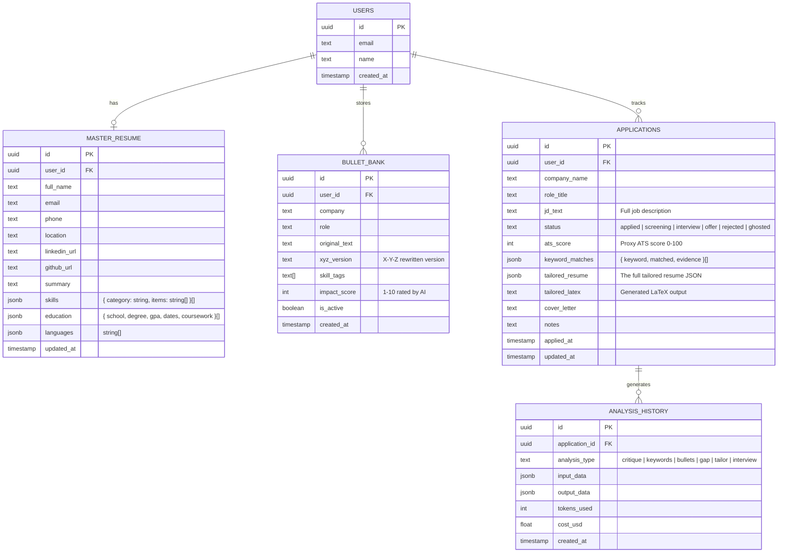
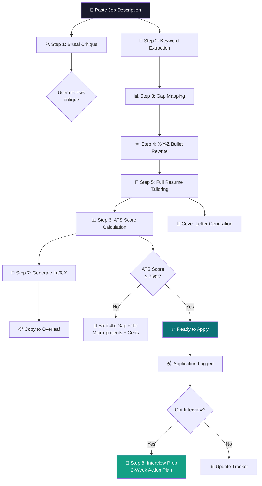
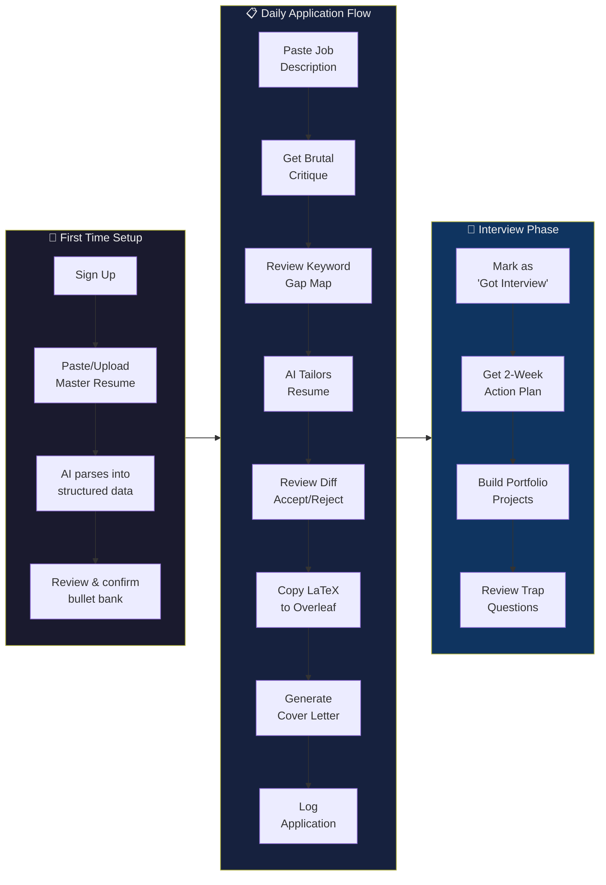

# ResumeForge — Complete Project Structure

## Project Identity

**Name:** ResumeForge  
**Tagline:** *"Brutal honesty. Perfect resumes. Real interviews."*  
**Goal:** An AI-powered resume tailoring engine that takes a job description + master resume, performs ruthless analysis, and outputs an interview-ready LaTeX resume — no sugarcoating, no fluff.

---

## Tech Stack

| Layer | Technology | Rationale |
|---|---|---|
| **Framework** | Next.js 14 (App Router) | Full-stack in one repo, SSR, API routes, great DX |
| **Language** | TypeScript | Type safety across frontend + backend |
| **Styling** | Vanilla CSS with custom design system | Full control, premium look, no framework dependency |
| **AI Model** | Claude 3.5 Sonnet (Anthropic API) | Best instruction-following, structured JSON output |
| **Database** | PostgreSQL via Supabase | Free tier, auth included, real-time subscriptions |
| **Auth** | Supabase Auth | Comes free with Supabase, Google/GitHub OAuth |
| **LaTeX Engine** | Custom template injection (string templating) | Simple, reliable, outputs Overleaf-ready [.tex](file:///Users/meetpatel/Library/Mobile%20Documents/com~apple~CloudDocs/Resumes%20/Meet_Patel_Resume_Capstone_Rewritten.tex) files |
| **Deployment** | Vercel | Free tier, auto-deploys from GitHub, edge functions |
| **Analytics** | PostHog (free tier) | Track feature usage, funnel conversion |

---

## Project Directory Structure

```
resumeforge/
├── .env.local                          # API keys (ANTHROPIC_API_KEY, SUPABASE_URL, etc.)
├── .env.example                        # Template for required env vars
├── next.config.js
├── package.json
├── tsconfig.json
│
├── public/
│   ├── fonts/                          # Self-hosted Inter/Outfit fonts
│   └── og-image.png                    # Social share image
│
├── src/
│   ├── app/                            # Next.js App Router
│   │   ├── layout.tsx                  # Root layout (fonts, global styles, auth provider)
│   │   ├── page.tsx                    # Landing page / hero
│   │   ├── globals.css                 # Global styles + CSS custom properties (design tokens)
│   │   │
│   │   ├── dashboard/
│   │   │   ├── page.tsx                # Main dashboard — application tracker, stats
│   │   │   └── layout.tsx              # Dashboard layout with sidebar nav
│   │   │
│   │   ├── analyze/
│   │   │   └── page.tsx                # Core feature: paste JD → brutal analysis
│   │   │
│   │   ├── tailor/
│   │   │   └── page.tsx                # Tailored resume output + diff view
│   │   │
│   │   ├── interview-prep/
│   │   │   └── page.tsx                # Post-selection action plan
│   │   │
│   │   ├── master-resume/
│   │   │   └── page.tsx                # Manage master resume (add/edit/tag bullets)
│   │   │
│   │   └── api/                        # Backend API routes
│   │       ├── analyze/
│   │       │   └── route.ts            # POST: JD vs resume brutal critique
│   │       ├── extract-keywords/
│   │       │   └── route.ts            # POST: Top 10 skills + gap mapping
│   │       ├── rewrite-bullets/
│   │       │   └── route.ts            # POST: X-Y-Z bullet transformation
│   │       ├── gap-filler/
│   │       │   └── route.ts            # POST: Micro-projects + certs suggestions
│   │       ├── tailor-resume/
│   │       │   └── route.ts            # POST: Full resume tailoring pipeline
│   │       ├── ats-score/
│   │       │   └── route.ts            # POST: ATS proxy score calculation
│   │       ├── interview-plan/
│   │       │   └── route.ts            # POST: 2-week action plan generator
│   │       ├── cover-letter/
│   │       │   └── route.ts            # POST: Matched cover letter generation
│   │       ├── generate-latex/
│   │       │   └── route.ts            # POST: JSON resume → LaTeX output
│   │       ├── master-resume/
│   │       │   └── route.ts            # CRUD: Master resume management
│   │       ├── applications/
│   │       │   └── route.ts            # CRUD: Application tracker
│   │       └── webhook/
│   │           └── route.ts            # Supabase auth webhooks
│   │
│   ├── components/
│   │   ├── ui/                         # Reusable UI primitives
│   │   │   ├── Button.tsx
│   │   │   ├── Card.tsx
│   │   │   ├── Badge.tsx
│   │   │   ├── Modal.tsx
│   │   │   ├── Textarea.tsx
│   │   │   ├── ProgressBar.tsx
│   │   │   ├── Tooltip.tsx
│   │   │   ├── Tabs.tsx
│   │   │   ├── Skeleton.tsx            # Loading skeletons
│   │   │   └── Toast.tsx               # Notification toasts
│   │   │
│   │   ├── layout/                     # Layout components
│   │   │   ├── Sidebar.tsx
│   │   │   ├── Header.tsx
│   │   │   └── Footer.tsx
│   │   │
│   │   ├── analysis/                   # Feature: Analysis & Critique
│   │   │   ├── JDInput.tsx             # Job description paste area
│   │   │   ├── CritiqueCard.tsx        # Individual criticism with severity badge
│   │   │   ├── CritiquePanel.tsx       # Full critique results panel
│   │   │   ├── KeywordMap.tsx          # Visual keyword match/gap grid
│   │   │   └── ATSScoreGauge.tsx       # Circular gauge showing ATS proxy score
│   │   │
│   │   ├── resume/                     # Feature: Resume Building
│   │   │   ├── BulletEditor.tsx        # Edit individual bullets with X-Y-Z preview
│   │   │   ├── ResumePreview.tsx       # Live LaTeX preview (rendered)
│   │   │   ├── ResumeDiff.tsx          # Side-by-side diff (original vs tailored)
│   │   │   ├── SectionEditor.tsx       # Edit resume sections (summary, skills, etc.)
│   │   │   └── LaTeXOutput.tsx         # Copy-to-clipboard LaTeX code block
│   │   │
│   │   ├── tracker/                    # Feature: Application Tracker
│   │   │   ├── ApplicationTable.tsx    # Table of all applications
│   │   │   ├── ApplicationCard.tsx     # Individual application card
│   │   │   ├── StatusBadge.tsx         # Applied/Screening/Interview/Offer/Rejected
│   │   │   └── WeeklyStats.tsx         # Weekly application stats chart
│   │   │
│   │   ├── interview/                  # Feature: Interview Prep
│   │   │   ├── ActionPlan.tsx          # 2-week plan display
│   │   │   ├── ProjectCard.tsx         # Suggested portfolio project card
│   │   │   ├── CertCard.tsx            # Suggested certification card
│   │   │   └── TrapQuestions.tsx       # Weakness prediction + defense scripts
│   │   │
│   │   └── master-resume/             # Feature: Master Resume Management
│   │       ├── BulletBank.tsx          # All stored bullet points, filterable
│   │       ├── BulletForm.tsx          # Add/edit a bullet point
│   │       └── SkillTagger.tsx         # Tag bullets with skill categories
│   │
│   ├── lib/                            # Shared utilities & core logic
│   │   ├── claude/                     # AI integration layer
│   │   │   ├── client.ts              # Anthropic SDK client initialization
│   │   │   ├── prompts/               # System prompts (the brain of the app)
│   │   │   │   ├── brutal-critic.ts   # Hiring manager critique persona
│   │   │   │   ├── keyword-extractor.ts  # Skill extraction + gap mapping
│   │   │   │   ├── bullet-rewriter.ts    # X-Y-Z formula transformer
│   │   │   │   ├── gap-filler.ts         # Micro-project + cert suggester
│   │   │   │   ├── resume-tailor.ts      # Full resume tailoring orchestrator
│   │   │   │   ├── interview-planner.ts  # 2-week action plan generator
│   │   │   │   └── cover-letter.ts       # Cover letter generator
│   │   │   └── pipeline.ts            # Orchestrates multi-step Claude calls
│   │   │
│   │   ├── latex/                      # LaTeX generation engine
│   │   │   ├── templates/
│   │   │   │   ├── standard.tex        # Default clean resume template
│   │   │   │   └── ats-friendly.tex    # Minimal formatting, max ATS compatibility
│   │   │   ├── renderer.ts            # Injects JSON data into LaTeX templates
│   │   │   └── sanitizer.ts           # Escapes special LaTeX characters (& % $ \ etc.)
│   │   │
│   │   ├── scoring/                    # ATS scoring logic
│   │   │   └── ats-calculator.ts      # Keyword match %, format compliance, section check
│   │   │
│   │   ├── db/                         # Database layer
│   │   │   ├── supabase.ts            # Supabase client
│   │   │   └── queries.ts             # Typed database queries
│   │   │
│   │   ├── types/                      # TypeScript type definitions
│   │   │   ├── resume.ts              # Resume, Bullet, Section types
│   │   │   ├── analysis.ts            # Critique, Keyword, Gap types
│   │   │   ├── application.ts         # Application tracker types
│   │   │   └── claude.ts              # Claude response types
│   │   │
│   │   └── utils/                      # General utilities
│   │       ├── diff.ts                 # Text diff algorithm for resume comparison
│   │       └── formatters.ts           # Date, number, text formatters
│   │
│   └── hooks/                          # React custom hooks
│       ├── useAnalysis.ts              # Manage analysis state + API calls
│       ├── useMasterResume.ts          # Master resume CRUD operations
│       ├── useApplications.ts          # Application tracker state
│       └── useClipboard.ts             # Copy LaTeX to clipboard
│
├── supabase/
│   └── migrations/                     # Database schema migrations
│       └── 001_initial_schema.sql
│
└── docs/
    ├── PROMPTS.md                      # Documentation of all system prompts
    └── ARCHITECTURE.md                 # Architecture decision records
```

---

## Database Schema



### SQL Migration (`001_initial_schema.sql`)

```sql
-- Users table (extends Supabase auth.users)
CREATE TABLE public.users (
    id UUID PRIMARY KEY REFERENCES auth.users(id) ON DELETE CASCADE,
    email TEXT NOT NULL,
    name TEXT,
    created_at TIMESTAMPTZ DEFAULT NOW()
);

-- Master resume (one per user)
CREATE TABLE public.master_resume (
    id UUID PRIMARY KEY DEFAULT gen_random_uuid(),
    user_id UUID NOT NULL REFERENCES public.users(id) ON DELETE CASCADE,
    full_name TEXT NOT NULL,
    email TEXT,
    phone TEXT,
    location TEXT,
    linkedin_url TEXT,
    github_url TEXT,
    summary TEXT,
    skills JSONB DEFAULT '[]',
    education JSONB DEFAULT '[]',
    languages JSONB DEFAULT '[]',
    updated_at TIMESTAMPTZ DEFAULT NOW(),
    UNIQUE(user_id)
);

-- Bullet bank (many per user)
CREATE TABLE public.bullet_bank (
    id UUID PRIMARY KEY DEFAULT gen_random_uuid(),
    user_id UUID NOT NULL REFERENCES public.users(id) ON DELETE CASCADE,
    company TEXT NOT NULL,
    role TEXT NOT NULL,
    original_text TEXT NOT NULL,
    xyz_version TEXT,
    skill_tags TEXT[] DEFAULT '{}',
    impact_score INT CHECK (impact_score BETWEEN 1 AND 10),
    is_active BOOLEAN DEFAULT TRUE,
    created_at TIMESTAMPTZ DEFAULT NOW()
);

-- Application tracker
CREATE TABLE public.applications (
    id UUID PRIMARY KEY DEFAULT gen_random_uuid(),
    user_id UUID NOT NULL REFERENCES public.users(id) ON DELETE CASCADE,
    company_name TEXT NOT NULL,
    role_title TEXT NOT NULL,
    jd_text TEXT NOT NULL,
    status TEXT DEFAULT 'applied' CHECK (status IN ('applied','screening','interview','offer','rejected','ghosted')),
    ats_score INT CHECK (ats_score BETWEEN 0 AND 100),
    keyword_matches JSONB DEFAULT '[]',
    tailored_resume JSONB,
    tailored_latex TEXT,
    cover_letter TEXT,
    notes TEXT,
    applied_at TIMESTAMPTZ DEFAULT NOW(),
    updated_at TIMESTAMPTZ DEFAULT NOW()
);

-- Analysis history (for cost tracking + caching)
CREATE TABLE public.analysis_history (
    id UUID PRIMARY KEY DEFAULT gen_random_uuid(),
    application_id UUID NOT NULL REFERENCES public.applications(id) ON DELETE CASCADE,
    analysis_type TEXT NOT NULL CHECK (analysis_type IN ('critique','keywords','bullets','gap','tailor','interview','cover_letter')),
    input_data JSONB NOT NULL,
    output_data JSONB NOT NULL,
    tokens_used INT DEFAULT 0,
    cost_usd FLOAT DEFAULT 0,
    created_at TIMESTAMPTZ DEFAULT NOW()
);

-- Indexes for performance
CREATE INDEX idx_bullet_bank_user ON public.bullet_bank(user_id);
CREATE INDEX idx_bullet_bank_tags ON public.bullet_bank USING GIN(skill_tags);
CREATE INDEX idx_applications_user ON public.applications(user_id);
CREATE INDEX idx_applications_status ON public.applications(status);
CREATE INDEX idx_analysis_history_app ON public.analysis_history(application_id);
CREATE INDEX idx_analysis_history_type ON public.analysis_history(analysis_type);
```

---

## Claude AI Prompt Pipeline

The core intellectual property of this app lives in the **system prompts**. Here's how the multi-step pipeline works:



### Prompt Design Principles

Each system prompt follows this structure:

```typescript
// Example: src/lib/claude/prompts/brutal-critic.ts

export const BRUTAL_CRITIC_PROMPT = `
You are a ruthless, time-starved hiring manager at a top-tier company.
You have 200 resumes to review today and you're looking for ANY reason to reject.

## Your Task
Analyze the candidate's resume against the provided job description.

## Output Format (strict JSON)
{
  "time_to_reject": "The exact point where you'd stop reading and why",
  "instant_rejections": [
    { "issue": "...", "severity": 1-10, "location": "section/line", "fix": "..." }
  ],
  "vague_statements": [
    { "original": "...", "problem": "...", "rewrite": "..." }
  ],
  "missing_requirements": [
    { "requirement": "from JD", "importance": "critical|nice-to-have", "suggestion": "..." }
  ],
  "strengths": [
    { "point": "...", "why_it_works": "..." }
  ],
  "overall_verdict": "hire | maybe | reject",
  "survival_time": "estimated seconds before rejection"
}

## Rules
- Be brutally honest. No encouragement, no positivity bias.
- Every criticism must include a specific fix.
- If the resume is genuinely strong, say so — but still find weaknesses.
- Never fabricate information about the candidate.
`;
```

---

## LaTeX Template Engine

Instead of asking Claude to write LaTeX directly (error-prone), structure it as:

```
Claude → JSON Resume Object → Template Renderer → Clean .tex File
```

### JSON Resume Schema (Claude outputs this)

```typescript
// src/lib/types/resume.ts

interface TailoredResume {
  header: {
    name: string;
    location: string;
    phone: string;
    email: string;
    linkedin?: string;
    github?: string;
    tagline: string;           // e.g., "PGWP-eligible | Available for full-time roles"
  };
  summary: string;
  skills: {
    category: string;          // e.g., "Languages", "Frameworks"
    items: string[];
  }[];
  experience: {
    title: string;
    company: string;
    location: string;
    dates: string;
    bullets: string[];         // Already X-Y-Z formatted
  }[];
  projects: {
    name: string;
    techStack: string;
    repoUrl?: string;
    bullets: string[];
  }[];
  education: {
    degree: string;
    school: string;
    location: string;
    dates: string;
    details: string;           // GPA, coursework, etc.
  }[];
  other?: {
    additional?: string;
    languages?: string;
  };
}
```

### LaTeX Sanitizer

```typescript
// src/lib/latex/sanitizer.ts
// Critical — prevents LaTeX compilation errors

export function sanitizeForLatex(text: string): string {
  return text
    .replace(/\\/g, '\\textbackslash{}')
    .replace(/&/g, '\\&')
    .replace(/%/g, '\\%')
    .replace(/\$/g, '\\$')
    .replace(/#/g, '\\#')
    .replace(/_/g, '\\_')
    .replace(/{/g, '\\{')
    .replace(/}/g, '\\}')
    .replace(/~/g, '\\textasciitilde{}')
    .replace(/\^/g, '\\textasciicircum{}');
}
```

---

## User Flow (Primary Path)



---

## Feature → Component → API Mapping

| # | Feature | Page | Key Components | API Route | Claude Prompt |
|---|---|---|---|---|---|
| 1 | Brutal Critique | `/analyze` | `JDInput`, `CritiquePanel`, `CritiqueCard` | `POST /api/analyze` | `brutal-critic.ts` |
| 2 | Keyword Gap Map | `/analyze` | `KeywordMap` | `POST /api/extract-keywords` | `keyword-extractor.ts` |
| 3 | X-Y-Z Bullets | `/tailor` | `BulletEditor` | `POST /api/rewrite-bullets` | `bullet-rewriter.ts` |
| 4 | Gap Filler | `/analyze` | `ProjectCard`, `CertCard` | `POST /api/gap-filler` | `gap-filler.ts` |
| 5 | ATS Score | `/tailor` | `ATSScoreGauge` | `POST /api/ats-score` | N/A (algorithmic) |
| 6 | Tailored Resume | `/tailor` | `ResumePreview`, `ResumeDiff`, `LaTeXOutput` | `POST /api/tailor-resume` | `resume-tailor.ts` |
| 7 | Interview Prep | `/interview-prep` | `ActionPlan`, `TrapQuestions` | `POST /api/interview-plan` | `interview-planner.ts` |
| 8 | Cover Letter | `/tailor` | `LaTeXOutput` (reused) | `POST /api/cover-letter` | `cover-letter.ts` |
| 9 | Application Tracker | `/dashboard` | `ApplicationTable`, `StatusBadge`, `WeeklyStats` | `CRUD /api/applications` | N/A |
| 10 | Master Resume | `/master-resume` | `BulletBank`, `BulletForm`, `SkillTagger` | `CRUD /api/master-resume` | N/A |
| 11 | Resume Diff View | `/tailor` | `ResumeDiff` | N/A (client-side) | N/A |
| 12 | LaTeX Export | `/tailor` | `LaTeXOutput` | `POST /api/generate-latex` | N/A (template engine) |

---

## Build Phases / Timeline

### Phase 1 — Foundation (Week 1)
- [ ] Initialize Next.js 14 project with TypeScript
- [ ] Set up Supabase project + run initial migration
- [ ] Build design system (CSS variables, base components)
- [ ] Implement auth (sign up, login, dashboard shell)
- [ ] Build master resume input + parsing page

### Phase 2 — Core AI Engine (Week 2)
- [ ] Claude API integration (`client.ts`, pipeline orchestrator)
- [ ] Implement all 7 system prompts
- [ ] Build `/analyze` page (brutal critique + keyword map)
- [ ] Build `/api/analyze` and `/api/extract-keywords` routes

### Phase 3 — Resume Tailoring (Week 3)
- [ ] Build X-Y-Z bullet rewriter
- [ ] Build full resume tailoring pipeline
- [ ] Build LaTeX template engine + sanitizer
- [ ] Build `/tailor` page with diff view + LaTeX output
- [ ] Implement ATS proxy scoring

### Phase 4 — Extended Features (Week 4)
- [ ] Build gap filler (micro-projects + certs)
- [ ] Build interview prep action plan
- [ ] Build cover letter generator
- [ ] Build application tracker dashboard

### Phase 5 — Polish & Deploy (Week 5)
- [ ] Responsive design / mobile optimization
- [ ] Loading states, error handling, edge cases
- [ ] Cost tracking (tokens used per analysis)
- [ ] Deploy to Vercel + custom domain
- [ ] Write README for GitHub (this is a portfolio piece)

---

## Verification Plan

### Automated Tests
- Run `npm run build` — ensure zero TypeScript errors and successful production build
- Run `npm run lint` — ensure no linting errors
- Test LaTeX sanitizer with unit tests: `npx jest src/lib/latex/sanitizer.test.ts`
- Test ATS calculator with unit tests: `npx jest src/lib/scoring/ats-calculator.test.ts`

### Browser Testing
- Open the application in a browser and walk through the complete flow:
  1. Sign up → set up master resume → paste a real JD → get critique → tailor resume → copy LaTeX → verify it compiles in Overleaf
  2. Verify the application tracker logs each submission
  3. Verify the diff view correctly highlights changes

### Manual Verification
- Copy generated LaTeX output into Overleaf and verify it compiles to a clean PDF without errors
- Submit the generated LaTeX to a real ATS system (e.g., apply to a test job on Workday) to verify parsability
- Compare AI critique quality by having a human reviewer independently critique the same resume

---

## User Review Required

> [!IMPORTANT]
> **A few decisions need your input before we start building:**

1. **Supabase vs. Local-only:** Do you want this as a multi-user SaaS app with authentication (Supabase), or a personal tool that runs locally with data stored in a JSON file? The SaaS route is more impressive for your portfolio, but takes longer.

2. **Anthropic API Key:** You'll need an Anthropic API key. Claude 3.5 Sonnet costs roughly ~$3/million input tokens and ~$15/million output tokens. A typical full analysis pipeline (all 7 features) would cost approximately $0.15–0.30 per job application. Are you comfortable with this?

3. **Scope for v1:** The full plan has 12 features. I'd recommend shipping a v1 with features 1-6, 10, and 12 (the core pipeline + master resume + LaTeX export), and adding 7-9, 11 as v2. Do you agree, or do you want everything in v1?

4. **Hosting your LaTeX templates:** Your existing [.tex](file:///Users/meetpatel/Library/Mobile%20Documents/com~apple~CloudDocs/Resumes%20/Meet_Patel_Resume_Capstone_Rewritten.tex) templates are clean. Should I use your current resume style (the Capstone version) as the default template, or design a new one?
