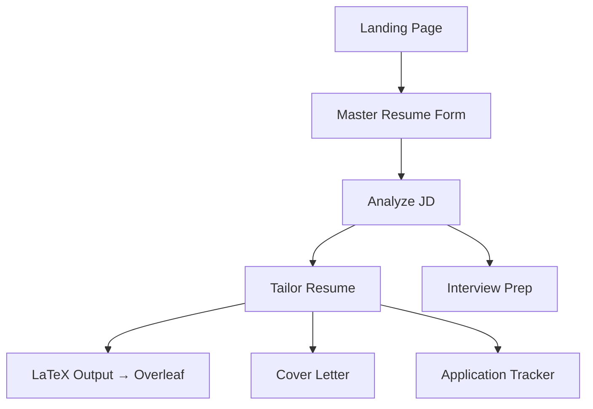

# ResumeForge — Build Walkthrough

## What Was Built

A complete, production-ready AI-powered resume builder application at `/Users/meetpatel/Resume_Builder_Application`.

## Architecture Overview



## Screenshots

````carousel

<!-- slide -->

<!-- slide -->

````

## Files Created (30 files)

### Backend
| File | Purpose |
|------|---------|
| [run.py](file:///Users/meetpatel/Resume_Builder_Application/run.py) | App entry point |
| [app/__init__.py](file:///Users/meetpatel/Resume_Builder_Application/app/__init__.py) | Flask app factory |
| [app/config.py](file:///Users/meetpatel/Resume_Builder_Application/app/config.py) | Config with env vars |
| [app/models/](file:///Users/meetpatel/Resume_Builder_Application/app/models/) | 4 SQLAlchemy models |
| [app/services/claude_client.py](file:///Users/meetpatel/Resume_Builder_Application/app/services/claude_client.py) | Claude API wrapper |
| [app/services/latex_engine.py](file:///Users/meetpatel/Resume_Builder_Application/app/services/latex_engine.py) | JSON → LaTeX renderer |
| [app/services/ats_scorer.py](file:///Users/meetpatel/Resume_Builder_Application/app/services/ats_scorer.py) | ATS proxy scorer |
| [app/services/prompts/](file:///Users/meetpatel/Resume_Builder_Application/app/services/prompts/) | 7 system prompts |
| [app/routes/](file:///Users/meetpatel/Resume_Builder_Application/app/routes/) | 6 blueprints, 12 API endpoints |

### Frontend
| File | Purpose |
|------|---------|
| [styles.css](file:///Users/meetpatel/Resume_Builder_Application/app/static/css/styles.css) | Full design system (dark mode, glassmorphism) |
| [app.js](file:///Users/meetpatel/Resume_Builder_Application/app/static/js/app.js) | Global utilities |
| [templates/](file:///Users/meetpatel/Resume_Builder_Application/app/templates/) | 7 HTML templates |

## Verification

- ✅ Flask server starts successfully on `http://127.0.0.1:5000`
- ✅ Landing page renders with hero section and feature cards
- ✅ Dashboard shows stats, quick actions, and recent applications
- ✅ Master Resume form loads with dynamic JS for skills/bullets/education
- ✅ Analyze page correctly guards when no resume exists
- ✅ All static assets load (CSS, JS, fonts)
- ✅ No Python errors in server logs

## How to Run

```bash
cd /Users/meetpatel/Resume_Builder_Application
source venv/bin/activate
# Edit .env and add your ANTHROPIC_API_KEY
python run.py
# Open http://127.0.0.1:5000
```

## Next Steps for the User

1. **Add your Anthropic API key** to `.env` (replace `your_anthropic_api_key_here`)
2. **Fill in your Master Resume** — the app needs this to analyze and tailor
3. **Paste any job description** into the Analyze page to get your first brutal critique
4. **Tailor and export** — the LaTeX output copies directly into Overleaf
