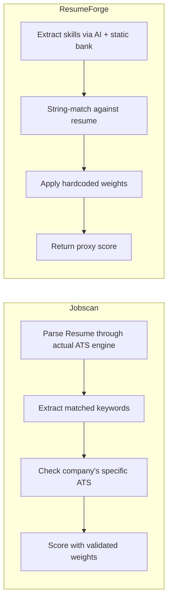

# 🔬 Brutal Competitive Analysis: ResumeForge vs. Industry Leaders

> **Verdict**: ResumeForge is an **ambitious, architecturally sound prototype** with a uniquely powerful AI pipeline. But compared to the tools people actually pay $50/month for, it has critical gaps in scoring methodology, user experience, and production readiness. Below is the full breakdown — no sugarcoating.

---

## 📊 Feature Matrix: Your App vs. The Competition

| Capability | Resume Worded | Jobscan | Teal | Enhancv | ResyMatch | **ResumeForge** |
|---|:---:|:---:|:---:|:---:|:---:|:---:|
| **General ATS Health Score (no JD)** | ✅ | ❌ | ❌ | ✅ | ❌ | ✅ |
| **JD-Matched ATS Score** | ❌ | ✅ | ✅ | ❌ | ✅ | ✅ |
| **Hard Skill Keyword Match** | ✅ | ✅ | ✅ | ✅ | ✅ | ✅ |
| **Soft Skill Matching** | ⚠️ | ✅ | ⚠️ | ❌ | ⚠️ | ✅ |
| **Bullet-Level Critique** | ✅ ⭐ | ❌ | ❌ | ❌ | ⚠️ | ✅ |
| **Weak Phrase Detection** | ✅ ⭐ | ❌ | ❌ | ❌ | ❌ | ✅ |
| **Action Verb Analysis** | ✅ | ❌ | ❌ | ❌ | ❌ | ✅ |
| **Measurable Impact Detection** | ✅ | ❌ | ❌ | ❌ | ✅ | ✅ |
| **Company-Specific ATS Tips** | ❌ | ✅ ⭐ | ❌ | ❌ | ❌ | ❌ |
| **Named ATS Platform Detection** | ❌ | ✅ ⭐ | ❌ | ❌ | ❌ | ❌ |
| **Side-by-Side JD Comparison** | ❌ | ❌ | ✅ ⭐ | ❌ | ❌ | ❌ |
| **Real-Time Edit Feedback** | ❌ | ❌ | ✅ | ✅ ⭐ | ❌ | ❌ |
| **Resume Auto-Tailoring** | ❌ | ❌ | ⚠️ (paid) | ❌ | ❌ | ✅ ⭐⭐ |
| **LaTeX/PDF Export** | ❌ | ❌ | ❌ | ❌ | ❌ | ✅ ⭐⭐ |
| **Cover Letter Generation** | ❌ | ❌ | ⚠️ (paid) | ❌ | ❌ | ✅ |
| **Gap-Filling Micro-Projects** | ❌ | ❌ | ❌ | ❌ | ❌ | ✅ ⭐⭐ |
| **Interview Prep Planner** | ❌ | ❌ | ❌ | ❌ | ❌ | ✅ ⭐ |
| **Application Tracker (CRM)** | ❌ | ❌ | ✅ ⭐ | ❌ | ❌ | ✅ |
| **Version History** | ❌ | ❌ | ✅ | ❌ | ❌ | ✅ |
| **Master Resume Vault** | ❌ | ❌ | ✅ | ❌ | ❌ | ✅ |
| **6-Second Scan Simulation** | ❌ | ❌ | ❌ | ❌ | ❌ | ✅ |
| **Multi-Step AI Pipeline** | ❌ | ❌ | ❌ | ❌ | ❌ | ✅ ⭐⭐ |
| **Cost Tracking per Scan** | ❌ | ❌ | ❌ | ❌ | ❌ | ✅ |
| **File Upload (PDF/DOCX/TXT)** | ✅ | ✅ | ✅ | ✅ | ✅ | ✅ |
| **No Account Required** | ❌ | ❌ | ❌ | ✅ | ✅ | ❌ |
| **Free Unlimited Scans** | ❌ | ❌ | ✅ | ✅ | ⚠️ | ✅ |

> [!IMPORTANT]
> **ResumeForge has MORE features than any single competitor.** No other tool combines ATS scoring + auto-tailoring + LaTeX export + gap analysis + interview prep in one pipeline. This is your moat.

---

## 🏗️ Architecture & Technical Analysis

### What You're Doing RIGHT (Genuine Strengths)

#### 1. 4-Step AI Pipeline — Unmatched by ANY Competitor
```
Step 0: JD Deep Analysis → Dynamic skill extraction
Step 1: Brutal Critique → Hiring manager simulation
Step 2: Keyword Extraction → Gap mapping
Step 3: Resume Tailoring → Surgical modifications
```
**No competitor does this.** Jobscan gives you a keyword list. Teal gives you a side-by-side. Resume Worded gives you a critique. You do ALL OF IT in a single pipeline and then *auto-tailor the resume*. This is genuinely innovative.

#### 2. Dual Scoring Modes
Your `calculate_ats_score()` (JD-matched) and `calculate_general_health_score()` (standalone) cover both **Need 1** and **Need 2** from your competitor list. Most tools only do one or the other.

#### 3. Honest, Non-Fabrication Policy
Your prompts repeatedly enforce `"ZERO TOLERANCE FOR FABRICATION"`. This is ethically superior to tools that suggest adding skills you don't have. The `keywords_skipped` field in tailoring output is transparent in a way competitors are not.

#### 4. LaTeX Output → Overleaf Pipeline
Nobody else does this. Getting a professionally typeset, ATS-compatible PDF from a single click is a genuinely useful differentiator for the tech audience.

#### 5. Gap Filler with Micro-Projects
The `gap_filler.py` prompt generates 2-week sprint plans, specific certifications with URLs, and interview talking points. **No competitor offers this.** Resume Worded tells you what's weak but never tells you *how to fix it in 2 weeks.*

#### 6. Dynamic vs Static Keyword Extraction
Your system has a **two-tier approach**: AI-driven dynamic extraction (via `jd_analyzer.py`) with a static fallback bank of 200+ tech skills. This is smart engineering — you get AI quality when the API is available and don't fail when it's not.

---

### What's WRONG (Brutal Honesty)

#### 🔴 CRITICAL Issues

##### 1. ATS Score Is Not an Actual ATS Score
> [!CAUTION]
> **The #1 criticism a user will make.**

Your `calculate_ats_score()` is a **proxy score** — a heuristic built on keyword matching, n-gram intersection, and regex. This is fundamentally different from what Jobscan does:

| What Jobscan Does | What ResumeForge Does |
|---|---|
| Reverse-engineers **real ATS parsers** (iCIMS, Workday, Greenhouse, Taleo, Lever) | Uses regex + curated keyword bank |
| Tests actual parser behavior | Estimates with string matching |
| Knows that Workday handles headers differently than Taleo | Treats all resumes the same way |
| Has company → ATS mapping database | No company-specific intelligence |

**Impact**: Your score of 78 for a resume doesn't mean the same thing as Jobscan's 78. Your score measures *keyword coverage*; Jobscan's measures *actual ATS passthrough probability*. Users who compare will notice the discrepancy.

**How to address**: Rename from "ATS Score" to **"Resume Match Score"** or **"Keyword Alignment Score"** — be transparent that it's a proxy, not a real ATS simulation.

##### 2. No Real-Time Feedback Loop
Novorésumé and Teal update the score **as you type**. Your app requires:
1. Go to Master Resume page → enter all data
2. Go to Tailor page → paste JD
3. Wait 30-60 seconds for 4 AI calls
4. Read results
5. *Manually iterate*

There is **no way to tweak a bullet point and instantly see the score change**. This is a fundamental UX gap compared to Teal/Novorésumé.

##### 3. Single-User Architecture (No Multi-Tenant)
Your `MasterResume.query.first()` pattern means one resume per instance. While `user_id` foreign keys exist on models, the routes don't filter by user. Multiple users on the same instance would share/overwrite data.

##### 4. 30-60 Second Pipeline Wait
The 4-step AI pipeline is powerful but SLOW. Users get a loading spinner for up to a minute. Competitors give partial results in seconds:
- Enhancv: ~3 minutes for full report, but shows incremental results
- Jobscan: keyword match in <10 seconds
- Teal: real-time as you type

---

#### 🟡 IMPORTANT Issues

##### 5. Scoring Weight Calibration — Not Validated
Your ATS score weights are:
```
Hard Skills: 35%  |  Soft Skills: 10%  |  Job Title: 15%
Sections: 10%     |  Metrics: 10%      |  Keywords: 10%
Format: 10%
```

These feel reasonable but there is **no evidence they correlate with actual ATS pass rates**. Jobscan calibrates their weights using real ATS pass/fail data from their 1M+ users. Your weights are assumptions.

**Resume Worded** evaluates 20+ criteria. **MyPerfectResume** evaluates 30+ criteria. Your JD-matched score evaluates 7 criteria. The health score evaluates 7 different criteria. That's good, but the granularity is lower than the leaders.

##### 6. No PDF/DOCX Preview
You output LaTeX and tell users "paste into Overleaf." This is a tech-savvy workflow. Competitors generate a downloadable PDF directly. Most job seekers (even in tech) don't use LaTeX.

##### 7. No Spelling/Grammar Check
Jobscan and Resume Worded check **spelling and grammar**. Your app doesn't. A typo in a resume is a kiss of death, and you're not catching it.

##### 8. Keyword Matching is Substring-Based
In `ats_scorer.py`, you check `if term in resume_lower`. This means:
- Searching for "java" matches "javascript" ❌
- Searching for "go" matches "google" ❌
- Searching for "r" matches every word containing "r" ❌

Jobscan uses whole-word boundary matching. Your regex in `_extract_hard_skills()` does use boundaries, but the dynamic path (when `jd_analysis` is provided) falls back to simple `in` operator.

##### 9. No LinkedIn Profile Optimization
Jobscan includes a LinkedIn optimizer. Your app is resume-only.

##### 10. No Batch/Comparison Mode
Teal lets you track unlimited jobs with a CRM dashboard. Your `applications.html` tracks applications, but there's no side-by-side comparison showing *which version scored highest* or *which tailoring worked best*.

---

#### 🟢 MINOR Issues

##### 11. No Mobile Responsiveness Validation
MyPerfectResume specifically advertises "mobile-friendly." Your templates use basic responsive CSS but haven't been tested against complex mobile layouts.

##### 12. Date Format Validation is Weak
Your health score checks for dates with a regex, but it doesn't validate **consistent** date formatting (e.g., mixing "Jan 2024" with "01/2024" with "2024").

##### 13. No Export Options Beyond LaTeX
No DOCX export, no PDF download, no plain text export. Just LaTeX.

##### 14. Hardcoded IT Role Keywords
`IT_ROLE_KEYWORDS` only covers 3 role families: `software_developer`, `data_analytics`, `it_devops`. A marketing manager, product manager, or finance analyst gets a generic health score.

---

## 📈 Scoring Methodology Deep Comparison

### Your JD-Matched Score vs. Jobscan



| Criterion | Jobscan | ResumeForge | Gap |
|---|---|---|---|
| Hard skills extraction | AI + crowdsourced | AI + 200-term bank | Comparable |
| Soft skills matching | Manual tag + AI | Stem-based matching | ResumeForge better |
| Job title match | Exact + variant | Regex + AI fallback | Comparable |
| Section completeness | Template-aware | Keyword search | Jobscan better |
| Measurable results | ❌ | ✅ (regex patterns) | **ResumeForge better** |
| Keyword frequency | Exact count | Approximate count | Jobscan better |
| Format compliance | Real ATS parser | Heuristic checks | Jobscan far better |
| Company-specific tips | ✅ (ATS database) | ❌ | Major gap |

### Your Health Score vs. Resume Worded

| Criterion | Resume Worded | ResumeForge | Gap |
|---|---|---|---|
| Parsability | Font/table analysis | Character-based heuristic | RW better |
| Structure | 20+ section checks | 5 required + 2 bonus | RW better |
| Action verbs | Per-bullet grading | First-word matching | Comparable |
| Impact/metrics | Sentence-level | Regex count | Comparable |
| Skills coverage | Industry benchmarks | Role-specific keyword bank | Comparable |
| Length/mechanics | Word count + density | Word count + dates | Comparable |
| Writing quality | AI tone/voice analysis | ❌ Not evaluated | Major gap |
| Brevity score | ✅ | ❌ | Gap |
| Bullet length | ✅ | ❌ | Gap |

---

## 🎯 What Makes Your App GENUINELY UNIQUE

These features exist in **no competitor at any price point**:

### 1. Auto-Tailoring with Anti-Fabrication
Your 4-step pipeline doesn't just *score* — it **rewrites the resume**. And it does so with explicit anti-fabrication guardrails:
```python
# From resume_tailor.py
"DO NOT fabricate, invent, or sugarcoat ANY experience, skill, or achievement"
"If a keyword is genuinely outside the candidate's background → SKIP IT"
"In keywords_skipped, list keywords you could NOT honestly incorporate and why"
```
This transparency is rare. Most AI tools will happily add fake skills.

### 2. Gap Filler → Actionable 2-Week Sprint
Nobody else says *"Here are 3 projects you can build in 2 weeks that will fill your gaps, with GitHub README instructions, exact resume lines to add, and interview talking points."* This is genuinely career-changing for under-qualified candidates.

### 3. LaTeX → Overleaf Pipeline
For the tech audience (which is your target), this is a killer feature. ATS-optimized LaTeX is something no competitor offers.

### 4. Cost Transparency
Every API call shows `cost_usd`. Users know exactly what each scan costs them. No hidden subscription fees.

### 5. Brutal Critique with Hiring Manager Simulation
Your `survival_time_seconds` metric and the ruthless tone differentiate this from every "score + tips" tool. Users remember being told "6 seconds before rejection."

---

## 🏆 Competitive Position Summary

```
┌─────────────────────────────────────────────────────────────┐
│                    COMPETITIVE LANDSCAPE                      │
├──────────────┬──────────────────┬────────────────────────────┤
│   CATEGORY   │    LEADER        │    ResumeForge Position    │
├──────────────┼──────────────────┼────────────────────────────┤
│ ATS Accuracy │ Jobscan          │ ❌ Not comparable          │
│ Critique     │ Resume Worded    │ ✅ Competitive (AI-based)  │
│ JD Matching  │ Teal/Jobscan     │ ✅ Competitive             │
│ Auto-Tailor  │ NOBODY           │ ⭐ Category Leader         │
│ Gap Filling  │ NOBODY           │ ⭐ Category Leader         │
│ LaTeX Export │ NOBODY           │ ⭐ Category Leader         │
│ Real-Time    │ Novorésumé/Teal  │ ❌ Missing entirely        │
│ Company ATS  │ Jobscan          │ ❌ Missing entirely        │
│ Free Tier    │ Teal/Enhancv     │ ✅ Unlimited (self-hosted) │
│ UX Polish    │ Teal             │ ⚠️ MVP-level              │
└──────────────┴──────────────────┴────────────────────────────┘
```

---

## 🚀 Priority Recommendations

### 🔴 P0 — Must Fix (Week 1)

1. **Rename "ATS Score" → "Resume Match Score"**
   - Don't claim ATS accuracy you don't have
   - Add a disclaimer: *"This score estimates keyword alignment. For actual ATS compatibility, cross-check with Jobscan."*

2. **Fix substring keyword matching**
   - `"java" in resume_lower` must not match "javascript"
   - Add word-boundary regex matching to the dynamic scoring path

3. **Add word-boundary matching for short skills**
   - "r", "go", "c" should not match random substrings
   - Use `\b` regex boundaries for skills shorter than 4 characters

### 🟡 P1 — Should Fix (Week 2-3)

4. **Add instant ATS score recalculation**
   - After tailoring, let users edit bullets and re-score without a full AI call
   - The `calculate_ats_score()` function is pure Python — no AI needed — so it can return in milliseconds

5. **Add PDF direct download**
   - Compile LaTeX server-side using a LaTeX Docker container or API (Overleaf API, LaTeX.online)
   - Users shouldn't need to know what Overleaf is

6. **Spelling/grammar check**
   - Integrate LanguageTool API (free, open source) or use the AI to flag errors

7. **Multi-user data isolation**
   - Replace `MasterResume.query.first()` with `MasterResume.query.filter_by(user_id=session['user_id']).first()`
   - Apply across all routes

### 🟢 P2 — Nice to Have (Month 2)

8. **Real-time score preview** — WebSocket-powered score widget
9. **DOCX export** — Using `python-docx` to generate Word docs
10. **Side-by-side version comparison** — Show score delta between resume versions
11. **Spelling/grammar integration** — LanguageTool or similar
12. **Streaming AI responses** — Show partial results as they generate
13. **More role families** — Add product management, marketing, finance to `IT_ROLE_KEYWORDS`
14. **Score history chart** — Plot ATS score improvements over time per application

---

## 💰 Business Model Comparison

| Tool | Free Tier | Paid Tier | Your Position |
|---|---|---|---|
| Resume Worded | 1 scan | $49/mo | Unlimited (self-hosted, pay per API call) |
| Jobscan | 5/month | $49.95/mo | Unlimited |
| Teal | Unlimited basics | $9/week | Unlimited |
| Enhancv | Unlimited scan | Builder paywall | Unlimited |
| **ResumeForge** | Unlimited | API cost (~$0.01-0.05/scan) | **Cheapest at scale** |

> [!TIP]
> Your biggest business advantage is **cost**. A full tailoring pipeline costs ~$0.01-0.05 in Bedrock API calls vs. $50/month for Jobscan. For a power user doing 30 tailors/month, that's $1.50 vs. $50.

---

## 🎯 Bottom Line

**What you've built is genuinely impressive for a solo project.** Your 4-step AI pipeline with anti-fabrication, gap filling, LaTeX output, and interview prep creates a comprehensive workflow no single competitor matches. The architecture is clean (factory pattern, service layer, AI clients, structured prompts), and the codebase is well-organized.

**But you're not competing on ATS accuracy** — and that's okay if you position correctly. You're competing on **workflow completeness**: analyze → critique → tailor → export → track → interview prep. That's your moat.

**The honest competitive position is:**
- ✅ Better than any single tool for **end-to-end workflow**
- ✅ Better than any free tool for **depth of analysis**
- ✅ Only tool that **auto-tailors AND outputs LaTeX**
- ❌ Not as accurate as Jobscan for **actual ATS parsing**
- ❌ Not as polished as Teal for **daily-driver UX**
- ❌ Not as granular as Resume Worded for **writing quality feedback**
- ⚠️ Pipeline speed (30-60s) is a UX friction point

**If you position ResumeForge as _"the AI resume tailor for tech professionals"_ rather than _"an ATS checker,"_ you avoid direct competition with Jobscan's core advantage and play to your unique strengths.**
